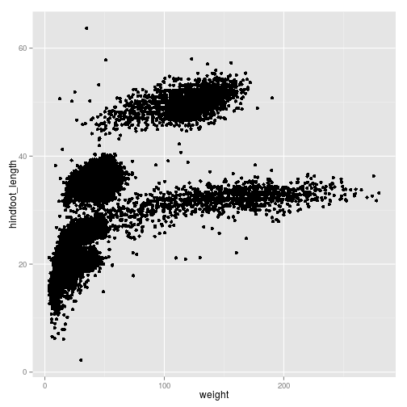
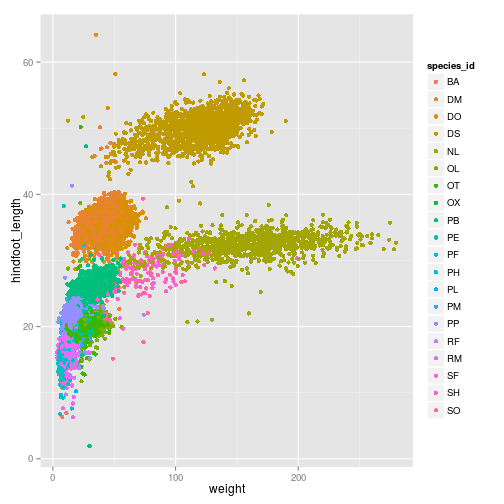
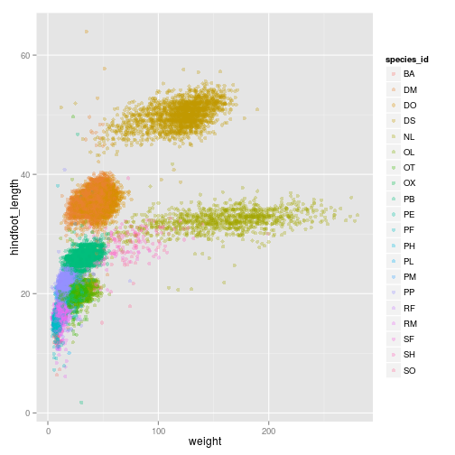
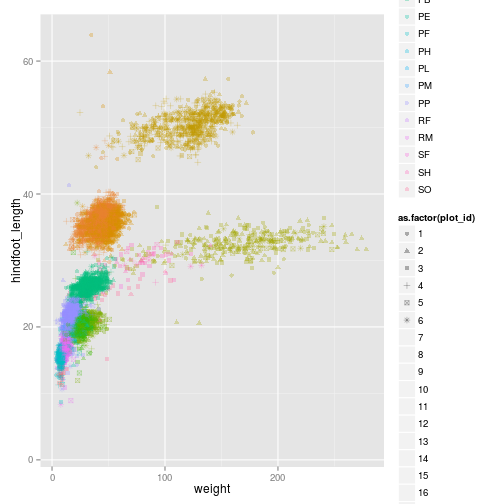
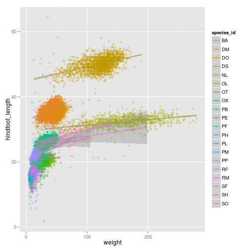
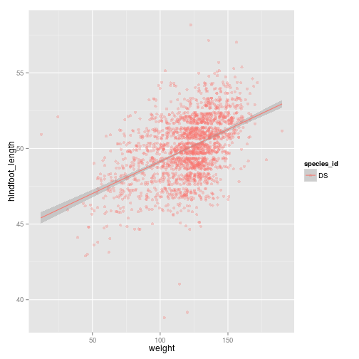
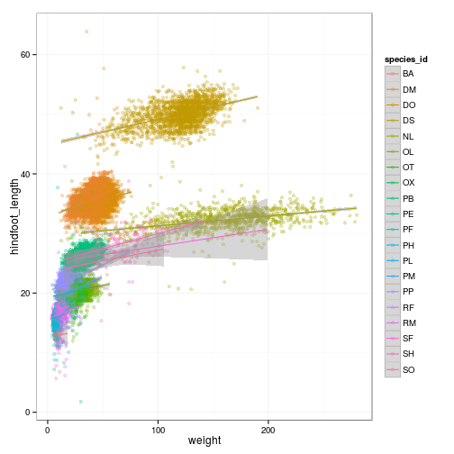
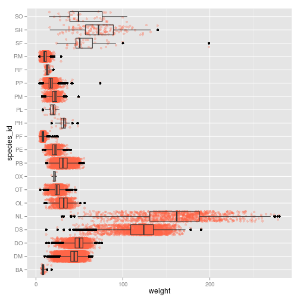
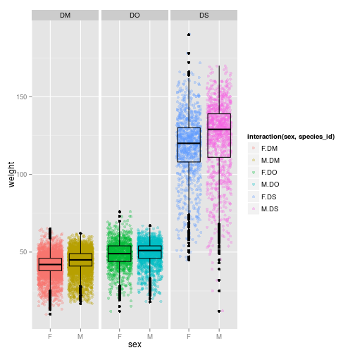
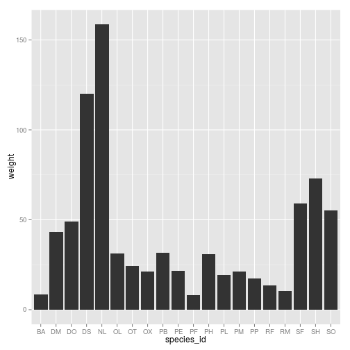

To make things easier, I created a cleaned up version of the surveys dataset
that we will use.


```r
download.file("http://r-bio.github.io/data/surveys_complete.csv",
              "data/surveys_complete.csv")
surveys_complete <- read.csv(file = "data/surveys_complete.csv")
```

In this lesson, we will be using functions from the ggplot2 package to create
plots. There are plotting capabilities that come with R, but ggplot2 provides a
consistent and powerful interface that allows you to produce high quality
graphics rapidly, allowing an efficient exploration of your datasets. The
functions in base R have different strengths, and are useful if you are trying
to draw very specific plots, in particular if they are plots that are not
representation of statistical graphics.

## Plotting with ggplot2

We will make the same plot using `ggplot2` package.

With ggplot, plots are build step-by-step in layers. This layering system is
based on the idea that statistical graphics are mapping from data to aesthetic
attributes (color, shape, size) of geometric objects (points, lines, bars). The
plot may also contain statistical transformations of the data, and is drawn on a
specific coordinate system. Faceting can be used to generate the same plot for
different subsets of the dataset.

To build a ggplot we need to:

- bind plot to a specific data frame


```r
ggplot(surveys_complete)
```

- define aestetics (`aes`), that maps variables in the data to axes on the plot
     or to plotting size, shape color, etc.,


```r
ggplot(surveys_complete, aes(x = weight, y = hindfoot_length))
```

```
## Error: No layers in plot
```

- add `geoms` -- graphical representation of the data in the plot (points,
     lines, bars). To add a geom to the plot use `+` operator:


```r
ggplot(surveys_complete, aes(x = weight, y = hindfoot_length)) +
  geom_point()
```

 

We can reduce over-plotting by adding some jitter:


```r
ggplot(surveys_complete, aes(x = weight, y = hindfoot_length)) +
  geom_point(position = position_jitter())
```

 

We can add additional aesthetic values according to other properties from our
dataset. For instance, if we want to color points differently depending on the
species.


```r
ggplot(surveys_complete, aes(x = weight, y = hindfoot_length, colour = species_id)) +
  geom_point(position = position_jitter())
```

 

We can also change the transparency


```r
ggplot(surveys_complete, aes(x = weight, y = hindfoot_length, colour = species_id)) +
  geom_point(alpha = 0.3,  position = position_jitter())
```

 

Just like we did for the species_id and the colors, we can do the same with
using different shapes for


```r
ggplot(surveys_complete, aes(x = weight, y = hindfoot_length, colour = species_id, shape = as.factor(plot_id))) +
  geom_point(alpha = 0.3,  position = position_jitter())
```

```
## Warning: The shape palette can deal with a maximum of 6 discrete values
## because more than 6 becomes difficult to discriminate; you have
## 24. Consider specifying shapes manually. if you must have them.
```

```
## Warning: Removed 21084 rows containing missing values (geom_point).
```

```
## Warning: The shape palette can deal with a maximum of 6 discrete values
## because more than 6 becomes difficult to discriminate; you have
## 24. Consider specifying shapes manually. if you must have them.
```

 

ggplot2 also allows you to calculate directly some statistical


```r
ggplot(surveys_complete, aes(x = weight, y = hindfoot_length, colour = species_id)) +
  geom_point(alpha = 0.3,  position = position_jitter()) + stat_smooth(method = "lm")
```

 


```r
ggplot(subset(surveys_complete,  species_id == "DS"), aes(x = weight, y = hindfoot_length, colour = species_id)) +
  geom_point(alpha = 0.3,  position = position_jitter()) + stat_smooth(method = "lm")
```

 


```r
ggplot(subset(surveys_complete, species_id == "DS"),
       aes(x = weight, y = hindfoot_length, colour = species_id)) +
  geom_point(alpha = 0.3,  position = position_jitter()) + stat_smooth(method = "lm") +
  ylim(c(0, 60))
```

 


```r
ggplot(surveys_complete,
       aes(x = weight, y = hindfoot_length, colour = species_id)) +
  geom_point(alpha = 0.3,  position = position_jitter()) + stat_smooth(method = "lm") +
  ##ylim(c(40, 60))
  coord_cartesian(ylim = c(40, 60))
```

 


```r
ggplot(surveys_complete, aes(x = weight, y = hindfoot_length, colour = species_id)) +
  geom_point(alpha = 0.3,  position = position_jitter()) + stat_smooth(method = "lm") +
  theme_bw()
```

 

## Boxplot

Visualising the distribution of weight within each species.


```r
ggplot(surveys_complete, aes(x = species_id, y = weight)) +
  geom_boxplot()
```

 

By adding points to boxplot, we can see particular measurements and the
abundance of measurements.


```r
ggplot(surveys_complete, aes(species_id, weight)) +
  geom_point(alpha=0.3, color="tomato", position = "jitter") +
  geom_boxplot(alpha=0) + coord_flip()
```

 

> ### Challenge
>
> Create boxplot for `hindfoot_length`, and change the color of the points.
> Replace the boxplot by a violin plot
> Add the layer `coord_flip()`

## Faceting


```r
ggplot(surveys_complete, aes(species_id, weight)) +
  geom_point(alpha=0.3, color="tomato", position = "jitter") +
  geom_boxplot(alpha=0) + coord_flip() + facet_wrap( ~ sex)
```

 

> ### Challenge
>
> Modify the data frame so we only look at males and females
> Change the colors, so points for males and females are different
> Change the data frame to only plot three species of your choosing


```r
ggplot(subset(surveys_complete, species_id %in% c("DO", "DM", "DS") & sex %in% c("F", "M")),
       aes(x = sex, y = weight,  colour = interaction(sex, species_id))) + facet_wrap( ~ species_id) +
       geom_point(alpha = 0.3, position = "jitter") +
       geom_boxplot(alpha = 0, colour = "black")
```

 

## barplot


```r
ggplot(surveys_complete, aes(species_id)) + geom_bar() #aes(stat = "identity"))

surveys_weights <- with(surveys_complete, tapply(weight, species_id, mean))
surveys_weights <- data.frame(species_id = levels(surveys_complete$species_id),
                              weight = surveys_weights)
surveys_weights <- surveys_weights[complete.cases(surveys_weights),  ]
ggplot(surveys_weights, aes(x = species_id, y = weight)) + geom_bar(stat = "identity")
```

 

> ### Challenge
>
> Repeat the same thing on the hindfoot length instead of the weight
