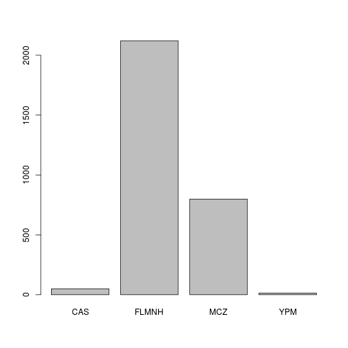

## <a name="sea-cucumber"></a> The sea cucumber challenge

For this challenge, you are going to use what you have learned in the first few
weeks to solve common issues when dealing with data, and perform a quick
exploration of the dataset. I tried to build the questions so that if you get
stuck, you can move on to the following questions.

I am providing you with two datasets:

- `holothuriidae-specimens.csv` contains a list of sea cucumber specimens housed
  at natural history museums across the United States. It's a simplification of
  a dataset I obtained through the
  [iDigBio portal](https://www.idigbio.org/portal).
- `holothuriidae-nomina-valid.csv` contains the list of currently accepted
  taxonomic names for sea cucumbers.

This is real raw data with errors and inconsistencies. The first dataset is
quite messy as it gathers information across several institutions, and for some
of them, the specimens haven't been examined in many years and may be identified
with a taxonomic name that is not currently valid.

Before we get started, let's get organized. This time, you will each work within
your own GitHub repository. I already created them for you but they are empty.

1. Start RStudio, and create a new project (File > New Project)
1. Choose "Version Control", and then "Git"
1. In repository URL type: `https://github.com/r-bio/challenges-yourfirstname`
   (e.g., mine is `https://github.com/r-bio/challenges-francois`) and choose a
   convenient location on your hardrive.
1. Create a new folder inside your working directory called `data`. You can do
   this using the "New Folder" icon in the File panel in RStudio or by typing
   `dir.create("data")` at the R console.
1. Create a new script file (File > New File > R script) and save it as
   `cuke-challenge-firstname.R`

Now, download the two data files inside your newly created `data` folder by
typing in your script file:


```r
download.file("http://r-bio.github.io/data/holothuriidae-specimens.csv",
              "data/holothuriidae-specimens.csv")
download.file("http://r-bio.github.io/data/holothuriidae-nomina-valid.csv",
              "data/holothuriidae-nomina-valid.csv")
```

Save your script, and click on the Git icon below the menu, and choose
"Commit". Check the boxes in the "Staged" column for the all the files and write
a commit message such as "add data". Click on the "Commit" button, and then the
"Push" icon. At least for me, at this stage I get an error message saying:

`error: unable to read askpass response from 'rpostback-askpass'`

This is apparently a known bug of RStudio (that I hope will be fixed soon). If
you get it, close the "Review Changes" window, and in RStudio, in the menu go to
Tools > Shell. There type:

`git push -u origin master`

it might ask for your GitHub username and password. Once it's done, we won't
have to do this again and will be able to use the RStudio interface directly. If
you have any problem at this stage, open an issue in the "logistics" repository
and I'll try to help you.

Now use the function `read.csv()` to load these datasets in memory. We'll call
`hol` the data frame that contains the information about the specimens, and
`nom` the data frame that contains the information about the validity of the
species names.


```r
hol <- read.csv(file="data/holothuriidae-specimens.csv", stringsAsFactors=FALSE)
nom <- read.csv(file="data/holothuriidae-nomina-valid.csv", stringsAsFactors=FALSE)
```

1. How many specimens are included in the data frame `hol`?
1. The column `dwc.institutionCode` in the `hol` data frame lists the museum
   where the specimens are housed:
   - How many institutions house specimens?
   - Draw a bar plot that shows the contribution of each institution
1. The column `dwc.year` indicates when the specimen was collected:
   - When was the oldest specimen included in this data frame collected ? (hint:
     It was not in year 1)
   - What proportion of the specimens in this data frame were collected between
     the years 2006 and 2014 (included)?
1. The function `nzchar()` on a vector returns `TRUE` for the positions of the
   vectors that are not empty, and `FALSE` otherwise. For instance,
   `nzchar(c("a", "b", "", "", "e"))` would return the vector `c(TRUE, TRUE,
   FALSE, FALSE, TRUE)`. The column `dwc.class` is supposed to contain the Class
   information for the specimens (here they should all be
   "Holothuroidea"). However, it is missing for some. Use the function `nzchar`
   to answer:
   - How many specimens do not have the information for class listed?
   - For the specimens where the information is missing, replace it with the
     information for their (again, they should all be "Holothuroidea").
1. Using the `nom` data frame, and the columns `Subgenus.current` and
   `Genus.current`, which of the genera listed has/have subgenera?
1. We want to combine the information included in the `nom` and the `hol`
  spreadsheets, to identify the specimens in the data frame that use species
  names that are not valid. We'll do this using the function `merge()`. By
  default `merge()` only returns the rows for which there is an exact match in
  both datasets. Here, because `nom` only includes the names of the valid
  species, the results would not include any of the specimen information that do
  not have valid names. Read the help of the `merge()` function to learn more
  about it.
  - With the function `paste()`, create a new column (called `genus_species`)
    that contains the genus (column `dwc.genus`) and species names (column
    `dwc.specificEpithet`) for the `hol` data frame.
  - Do the same thing with the `nom` data frame (using the columns
    `Genus.current` and `species.current`).
  - Use `merge()` to combine `hol` and `nom` (hint: you will need to use the
    `all.x` argument, read the help to figure it out, and check that the
    resulting data frame has the same number of rows as `hol`).
  - Create a data frame that contains the information for the specimens
    identified with an invalid species name (content of the column `Status` is
    not `NA`)? (hint: specimens identified only with a genus name shouldn't be
    included in this count.)
  - Select only the columns: `idigbio.uuid`, `dwc.genus`, `dwc.specificEpithet`,
    `dwc.institutionCode`, `dwc.catalogNumber` from this data frame and export
    the data as a CSV file (using the function `write.csv`) named
    `holothuriidae-invalid.csv`

Once you are done, commit your script to your repository:
Git icon > "Commit", check the box next to the file name for your script, add a
message, click on the Commit button and then on the push button.

<!---


```r
## How many specimens?
nrow(hol)
```

```
## [1] 2984
```

```r
## How many institutions house specimens?
length(unique(hol$dwc.institutionCode))
```

```
## [1] 4
```

```r
## Barplot that shows the contribution of each institution:
barplot(table(hol$dwc.institutionCode))
```

 

```r
## When was the oldest specimen collected?
min(hol$dwc.year[hol$dwc.year > 1700], na.rm=TRUE)
```

```
## [1] 1902
```

```r
## What is the proportion of speicmens collected between 2006 and 2014
sum(hol$dwc.year >= 2006 & hol$dwc.year <= 2014, na.rm=TRUE)/nrow(hol) # for all specimens
```

```
## [1] 0.4932976
```

```r
sum(hol$dwc.year >= 2006 & hol$dwc.year <= 2014, na.rm=TRUE)/sum(!is.na(hol$dwc.year)) # for all specimens with a year
```

```
## [1] 0.6986236
```

```r
## How many specimens are missing the "Class" data?
sum(!nzchar(hol$dwc.class))
```

```
## [1] 50
```

```r
## Add the missing data
hol$dwc.class[!nzchar(hol$dwc.class)] <- "Holothuroidea"

## Which of the genera listed have subgenera?
unique(nom$Genus.current[nzchar(nom$Subgenus.current)])
```

```
## [1] "Holothuria"
```

```r
## Combine the two data frames
hol[["genus_species"]] <- paste(hol$dwc.genus, hol$dwc.specificEpithet)
nom[["genus_species"]] <- paste(nom$Genus.current, nom$species.current)
hol_combined <- merge(hol, nom, all.x=TRUE)
nrow(hol_combined) == nrow(hol)
```

```
## [1] TRUE
```

```r
## How many specimens are identified with currently invalid species names?
hol_invalid <- subset(hol_combined, is.na(Status) & nzchar(dwc.specificEpithet))
write.csv(hol_invalid[, c("idigbio.uuid", "dwc.genus", "dwc.specificEpithet", "dwc.institutionCode", "dwc.catalogNumber")],
          file="holothuriidae-invalid.csv", row.names=FALSE)
```

--->
